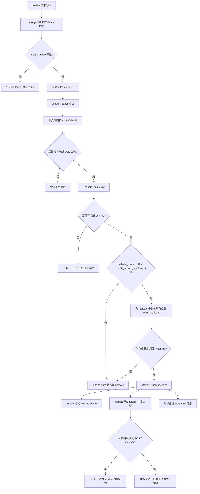

[TOC]

## 1. 功能目标

Patroni 默认策略是：一旦 leader 刷新不了 DCS 里的锁，就把自己当成可能发生了网络分区的 primary，然后主动 demote，避免脑裂。

`failsafe_mode` 是这条默认规则上的一个保守例外：只有当当前节点本来就是 primary，`failsafe_mode` 已开启，并且它还能联系到 `/failsafe` 中记录的全部成员时，才允许它在 DCS 暂时异常时继续提供写服务。

这件事在代码里的落点，就是 DCS 出错后 primary 不会立刻无条件 demote，而是先走一次 `check_failsafe_topology()`：

```python
def _handle_dcs_error(self) -> str:
    if not self.is_paused() and self.state_handler.is_running():
        if self.state_handler.is_primary():
            if self.is_failsafe_mode() and self.check_failsafe_topology():
                self.set_is_leader(True)
                self._failsafe.set_is_active(time.time())
                self.watchdog.keepalive()
                self._sync_replication_slots(True)
                return 'continue to run as a leader because failsafe mode is enabled and all members are accessible'
            self._failsafe.set_is_active(0)
            msg = 'demoting self because DCS is not accessible and I was a leader'
            if not self._async_executor.try_run_async(msg, self.demote, ('offline',)):
                return msg
            logger.warning('AsyncExecutor is busy, demoting from the main thread')
            self.demote('offline')
            return 'demoted self because DCS is not accessible and I was a leader'
        else:
            self._sync_replication_slots(True)
    return 'DCS is not accessible'
```

所以，failsafe 不是用来选出新主的，而是在 DCS 暂时失效时，给“已经是 primary 的节点”一个继续活着的兜底流程。

## 2. 整体流程



## 3. 流程分析

### 3.1 开关从哪来

`failsafe_mode` 不是本地临时变量，而是从全局动态配置里判断的。HA 层每次需要决定是否启用 failsafe，都统一走这段逻辑：

```python
def is_failsafe_mode(self) -> bool:
    """:returns: `True` if failsafe_mode is enabled in global configuration."""
    return global_config.check_mode('failsafe_mode')
```

所以后面所有涉及 `/failsafe` 的行为，本质上都受这个判断控制。

### 3.2 正常情况下 leader 怎么维护 `/failsafe`

正常路径不是单独有个后台任务去写 `/failsafe`，而是 leader 在刷新 DCS leader lock 时顺手维护。

先构造一份“成员名 -> API 地址”的拓扑快照：

```python
def _failsafe_config(self) -> Optional[Dict[str, str]]:
    if self.is_failsafe_mode():
        ret = {m.name: m.api_url for m in self.cluster.members if m.api_url}
        if self.state_handler.name not in ret:
            ret[self.state_handler.name] = self.patroni.api.connection_string
        return ret
```

然后把这份拓扑作为 `failsafe` 参数传给 DCS：

```python
def update_lock(self, update_status: bool = False) -> bool:
    ...
    ret = self.dcs.update_leader(self.cluster, last_lsn, slots, self._failsafe_config())
    ...
    return ret
```

最后由 DCS 抽象层在 leader lock 更新成功后真正写入 `/failsafe`：

```python
def write_failsafe(self, value: Dict[str, str]) -> None:
    """Write the ``/failsafe`` key in DCS.

    :param value: dictionary value to set, consisting of the ``name`` and ``api_url`` of members.
    """
    if not (isinstance(self._last_failsafe, dict) and deep_compare(self._last_failsafe, value)) \
            and self._write_failsafe(json.dumps(value, separators=(',', ':'))):
        self._last_failsafe = value

def update_leader(self,
                  cluster: Cluster,
                  last_lsn: Optional[int],
                  slots: Optional[Dict[str, int]] = None,
                  failsafe: Optional[Dict[str, str]] = None) -> bool:
    ret = self._update_leader(cluster.leader)
    if ret and last_lsn:
        status: Dict[str, Any] = {self._OPTIME: last_lsn, 'slots': slots or None,
                                  'retain_slots': self._build_retain_slots(cluster, slots)}
        self.write_status(status)

    if ret and failsafe is not None:
        self.write_failsafe(failsafe)

    return ret
```

所以 `/failsafe` 不是运行时现算的视图，而是 leader 在正常时期持续写进 DCS 的一份集群成员快照。

### 3.3 DCS 挂了怎么办

DCS 异常时，主逻辑就是 `_handle_dcs_error()`。

```python
def _handle_dcs_error(self) -> str:
    if not self.is_paused() and self.state_handler.is_running():
        if self.state_handler.is_primary():
            if self.is_failsafe_mode() and self.check_failsafe_topology():
                self.set_is_leader(True)
                self._failsafe.set_is_active(time.time())
                self.watchdog.keepalive()
                self._sync_replication_slots(True)
                return 'continue to run as a leader because failsafe mode is enabled and all members are accessible'
            self._failsafe.set_is_active(0)
            msg = 'demoting self because DCS is not accessible and I was a leader'
            if not self._async_executor.try_run_async(msg, self.demote, ('offline',)):
                return msg
            logger.warning('AsyncExecutor is busy, demoting from the main thread')
            self.demote('offline')
            return 'demoted self because DCS is not accessible and I was a leader'
        else:
            self._sync_replication_slots(True)
    return 'DCS is not accessible'
```

这里可以直接看出两条分支：

1. 当前节点是 primary：
   先尝试 `is_failsafe_mode() and check_failsafe_topology()`，通过才继续当主；否则 demote。
2. 当前节点不是 primary：
   不会因为 failsafe 自动升主，只是继续同步 replication slots 相关状态。

这就是为什么 failsafe 的定位是“防误降级”，而不是“失去 DCS 后还能继续安全选主”。

### 3.4 `check_failsafe_topology()` 怎么判断能不能继续当主

这个函数把“还能不能继续活着”落成了一个非常硬的条件判断：

```python
def check_failsafe_topology(self) -> bool:
    failsafe = self.dcs.failsafe
    if not isinstance(failsafe, dict) or self.state_handler.name not in failsafe:
        return False
    data: Dict[str, Any] = {
        'name': self.state_handler.name,
        'conn_url': self.state_handler.connection_string,
        'api_url': self.patroni.api.connection_string,
    }
    try:
        data['slots'] = self.state_handler.slots()
    except Exception:
        logger.exception('Exception when called state_handler.slots()')

    members = [RemoteMember(name, {'api_url': url})
               for name, url in failsafe.items() if name != self.state_handler.name]
    if not members:  # A sinlge node cluster
        return True
    pool = ThreadPool(len(members))
    call_failsafe_member = functools.partial(self.call_failsafe_member, data)
    results: List[_FailsafeResponse] = pool.map(call_failsafe_member, members)
    pool.close()
    pool.join()
    ret = all(r.accepted for r in results)
    if ret:
        self._failsafe.update_slots({r.member_name: r.lsn for r in results if r.lsn})
    return ret
```

这段代码对应出来的规则非常清晰：

- `/failsafe` 不是合法字典，失败。
- 当前节点名字不在 `/failsafe`，失败。
- 单节点集群没有其他成员，直接成功。
- 多节点集群时，对除自己以外的所有成员并发发 `POST /failsafe`。
- 最终结果必须是 `all(r.accepted for r in results)`，也就是全员确认，不是多数派确认。

### 3.5 primary 发 `POST /failsafe`，replica 怎么处理

REST 入口先判断 failsafe 是否启用，启用后把请求交给 HA：

```python
@check_access(allowlist_check_members=False)
def do_POST_failsafe(self) -> None:
    """Handle a ``POST`` request to ``/failsafe`` path.

    Writes a response with HTTP status ``200`` if this node is a Standby, or with HTTP status ``500`` if this is
    the primary. In addition to that it returns absolute value of received/replayed LSN in the ``lsn`` header.

    .. note::
        If ``failsafe_mode`` is not enabled, then write a response with HTTP status ``502``.
    """
    if self.server.patroni.ha.is_failsafe_mode():
        request = self._read_json_content()
        if request:
            ret = self.server.patroni.ha.update_failsafe(request)
            headers = {'lsn': str(ret)} if isinstance(ret, int) else {}
            message = ret if isinstance(ret, str) else 'Accepted'
            code = 200 if message == 'Accepted' else 500
            self.write_response(code, message, headers=headers)
    else:
        self.send_error(502)
```

真正决定“接不接受这个 leader”的是 `update_failsafe()`：

```python
def update_failsafe(self, data: Dict[str, Any]) -> Union[int, str, None]:
    """Update failsafe state.

    :param data: deserialized JSON document from REST API call that contains information about current leader.

    :returns: the reason why caller shouldn't continue as a primary or the current value of received/replayed LSN.
    """
    if self.state_handler.state == 'running' and self.state_handler.role == 'primary':
        return 'Running as a leader'
    self._failsafe.update(data)
    return self._last_wal_lsn
```

这里的含义是：

- 如果接收方自己也是 primary，就返回 `"Running as a leader"`，也就是拒绝承认对方继续当主。
- 如果接收方是 replica，就把对方传来的 leader 信息写进本地 `Failsafe` 状态，然后返回本地的 `LSN`。

因此，replica 不会去改 DCS；它只是把 `POST /failsafe` 当作“leader 还活着”的心跳。

### 3.6 `Failsafe` 本地状态对象到底存了什么

replica 和 primary 的 failsafe 活跃态都落在 `Failsafe` 这个内存对象里：

```python
class Failsafe(object):
    def __init__(self, dcs: AbstractDCS) -> None:
        self._lock = RLock()
        self._dcs = dcs
        self._reset_state()

    def update(self, data: Dict[str, Any]) -> None:
        with self._lock:
            self._last_update = time.time()
            self._name = data['name']
            self._conn_url = data['conn_url']
            self._api_url = data['api_url']
            self._slots = data.get('slots')

    def _reset_state(self) -> None:
        self._last_update = 0
        self._name = ''
        self._conn_url = None
        self._api_url = None
        self._slots = None

    def is_active(self) -> bool:
        with self._lock:
            return self._last_update + self._dcs.ttl > time.time()

    def set_is_active(self, value: float) -> None:
        with self._lock:
            self._last_update = value
            if not value:
                self._reset_state()
```

这段代码说明：

- `_last_update` 是 failsafe 最近一次被刷新或触发的时间点。
- `_name`、`_conn_url`、`_api_url`、`_slots` 保存 leader 的身份和复制状态。
- `is_active()` 的判断条件就是 `_last_update + ttl > time.time()`。
- primary 在本地通过 `set_is_active()` 标记激活。
- replica 通过收到 `POST /failsafe` 触发 `update()` 来刷新激活时间。

超过 `ttl` 之后，这个状态自然过期。

### 3.7 DCS 不可用时，replica 怎么继续“看见” leader

关键点不在 DCS，而在本地把缓存中的 leader 信息重新注入 cluster 视图。

先看 `Failsafe.leader` 和 `update_cluster()`：

```python
@property
def leader(self) -> Optional[Leader]:
    with self._lock:
        if self._last_update + self._dcs.ttl > time.time():
            return Leader('', '', RemoteMember(self._name, {'api_url': self._api_url,
                                                            'conn_url': self._conn_url,
                                                            'slots': self._slots}))

def update_cluster(self, cluster: Cluster) -> Cluster:
    leader = self.leader
    if leader:
        status = Status(cluster.status[0], leader.member.data['slots'], *cluster.status[2:])
        cluster = Cluster(*cluster[0:2], leader, status, *cluster[4:])
        for member in cluster.members:
            if member.replicatefrom and status.slots and member.name in status.slots:
                member.data['xlog_location'] = status.slots[member.name]
    return cluster
```

再看 HA 读取 DCS 后怎么用它：

```python
def load_cluster_from_dcs(self) -> None:
    cluster = self.dcs.get_cluster()

    if not cluster.is_unlocked() or not self.old_cluster:
        self.old_cluster = cluster
    self.cluster = cluster

    if self.cluster.is_unlocked() and self.is_failsafe_mode():
        self.cluster = cluster = self._failsafe.update_cluster(cluster)

    if not self.has_lock(False):
        self.set_is_leader(False)

    self._leader_timeline = cluster.leader.timeline if cluster.leader else None
```

也就是说，当 DCS 看起来“没有 leader”时，只要本地 `Failsafe` 还没过期，Patroni 就会把缓存的 leader 信息重新塞回 cluster 视图里。这样 replica 在 `ttl` 时间内仍然会认为 leader 存在，不会立刻进入错误的 leader race。

### 3.8 为什么还要传 `slots` 和 `LSN`

因为 DCS 故障期间还得继续推进复制槽，否则 WAL 会一直堆积。

primary 在 `check_failsafe_topology()` 里把自己的 `slots` 带给其他成员：

```python
data: Dict[str, Any] = {
    'name': self.state_handler.name,
    'conn_url': self.state_handler.connection_string,
    'api_url': self.patroni.api.connection_string,
}
try:
    data['slots'] = self.state_handler.slots()
except Exception:
    logger.exception('Exception when called state_handler.slots()')
```

replica 处理完 `POST /failsafe` 之后，在响应头里返回自己的 LSN：

```python
ret = self.server.patroni.ha.update_failsafe(request)
headers = {'lsn': str(ret)} if isinstance(ret, int) else {}
message = ret if isinstance(ret, str) else 'Accepted'
code = 200 if message == 'Accepted' else 500
self.write_response(code, message, headers=headers)
```

primary 收齐响应之后把这些 LSN 缓存在本地：

```python
ret = all(r.accepted for r in results)
if ret:
    self._failsafe.update_slots({r.member_name: r.lsn for r in results if r.lsn})
return ret
```

然后在 DCS 异常路径继续推进 replication slots：

```python
def _sync_replication_slots(self, dcs_failed: bool) -> List[str]:
    slots: List[str] = []

    if not self.cluster or dcs_failed and not self.is_failsafe_mode():
        return slots

    cluster = self._failsafe.update_cluster(self.cluster) if self.is_failsafe_mode() else self.cluster
    if cluster:
        slots = self.state_handler.slots_handler.sync_replication_slots(cluster, self.patroni)
    return [] if self.failsafe_is_active() else slots
```

这就是为什么 failsafe 不是只有“心跳确认”这么简单，它还顺带承担了 DCS 异常期间复制槽状态传播的职责。

### 3.9 对选主资格的影响

failsafe 不只影响“旧 primary 是否可以继续活”，还影响“谁有资格参与 leader race”。

```python
all_known_members = self.old_cluster.members
if self.is_failsafe_mode():
    failsafe_members = self.dcs.failsafe
    if isinstance(failsafe_members, dict):
        if failsafe_members and self.state_handler.name not in failsafe_members:
            return False
        all_known_members += [RemoteMember(name, {'api_url': url}) for name, url in failsafe_members.items()]
all_known_members += self.cluster.members
...
return self._is_healthiest_node(members.values())
```

这里体现了两件事：

- 如果 `/failsafe` 里有成员列表，但当前节点不在里面，它会直接失去竞选资格。
- 参与健康比较的候选集合，不只是当前 DCS 里看到的成员，还会把 `/failsafe` 中记住的成员一起算进去。

因此 `/failsafe` 不只是一个“主存活检查列表”，它也约束了 leader race 的候选边界。

## 4. 总结

failsafe 不是独立状态机，而是嵌在 Patroni 原有 HA 循环中的一条保守兜底路径：

1. 正常时，leader 刷新锁时顺便把成员拓扑写进 `/failsafe`。
2. DCS 出问题时，只有当前 primary 能尝试走 failsafe。
3. primary 必须主动联系 `/failsafe` 里的每一个其他成员。
4. 只有所有成员都确认，它才允许自己继续写。
5. replica 把 `POST /failsafe` 当成 leader 心跳，在 `ttl` 内保留 leader 视图并继续传播 slots/LSN。

## 5. 边界和坑

### 5.1 `/failsafe` 数据非法或当前节点不在里面

不是尽力而为，而是直接失败：

```python
failsafe = self.dcs.failsafe
if not isinstance(failsafe, dict) or self.state_handler.name not in failsafe:
    return False
```

### 5.2 全部成员确认，不是多数派

判断条件写死就是 `all(...)`：

```python
ret = all(r.accepted for r in results)
```

只要一个成员不接受、不可达、超时，failsafe 就失败。

### 5.3 有一个成员不响应，primary 就会 demote

请求失败会返回未接受状态：

```python
def call_failsafe_member(self, data: Dict[str, Any], member: Member) -> _FailsafeResponse:
    endpoint = 'failsafe'
    url = member.get_endpoint_url(endpoint)
    try:
        response = self.patroni.request(member, 'post', endpoint, data, timeout=2, retries=1)
        response_data = response.data.decode('utf-8')
        logger.info('Got response from %s %s: %s', member.name, url, response_data)
        accepted = response.status == 200 and response_data == 'Accepted'
        return _FailsafeResponse(member.name, accepted, parse_int(response.headers.get('lsn')))
    except Exception as e:
        logger.warning("Request failed to %s: POST %s (%s)", member.name, url, e)
    return _FailsafeResponse(member.name, False, None)
```

而上层会把这个结果汇总到 `all(r.accepted for r in results)`；一旦失败，最后就会落回 demote 分支。

### 5.4 单节点集群是特例

代码里明确写了单节点直接成功：

```python
members = [RemoteMember(name, {'api_url': url})
           for name, url in failsafe.items() if name != self.state_handler.name]
if not members:  # A sinlge node cluster
    return True
```

### 5.5 primary 和 replica 的 active 状态可能短暂不一致

primary 通过本地设置激活时间：

```python
self._failsafe.set_is_active(time.time())
```

replica 则是收到 `POST /failsafe` 才更新：

```python
self._failsafe.update(data)
```

两者刷新时机不同，所以短时间内看到不同的 `failsafe_is_active` 是正常现象。

### 5.6 新节点没进 `/failsafe` 前不能参与竞选

这不是文档约定，而是代码直接卡死的：

```python
if failsafe_members and self.state_handler.name not in failsafe_members:
    return False
```

只要 leader 还没把这个节点写入 `/failsafe`，它就不具备完整竞选资格。

### 5.7 DCS 长时间故障时，failsafe 不是永久运行模式

每次碰到 DCS 异常，primary 都要重新跑这一整套检查：

```python
if self.is_failsafe_mode() and self.check_failsafe_topology():
    self.set_is_leader(True)
    self._failsafe.set_is_active(time.time())
    self.watchdog.keepalive()
    self._sync_replication_slots(True)
    return 'continue to run as a leader because failsafe mode is enabled and all members are accessible'
self._failsafe.set_is_active(0)
...
self.demote('offline')
```

因此它能扛的是“短时 DCS 故障”，不是“无限期脱离 DCS 运行”。只要某次检查联系不到全部成员，当前 primary 最终还是会被降级。
